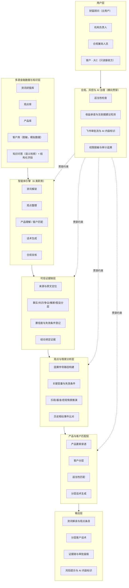
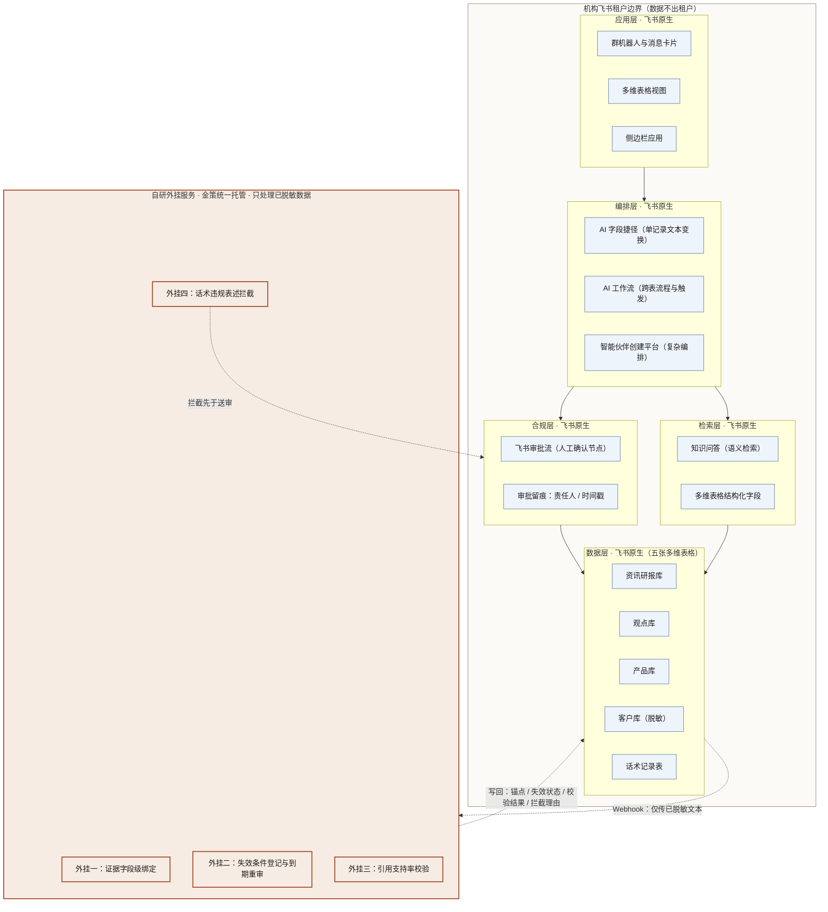
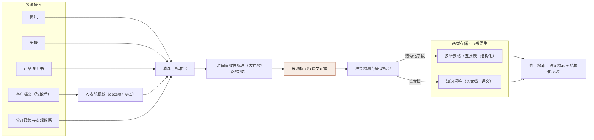
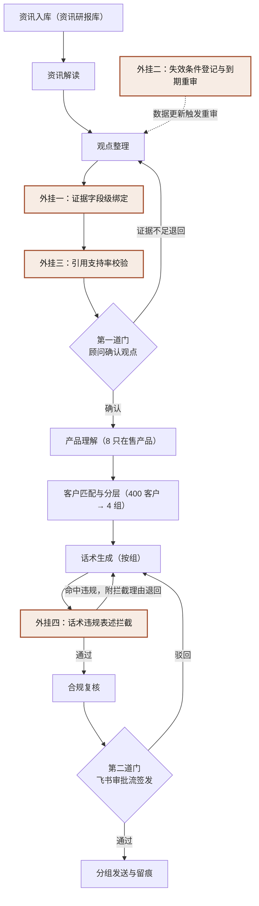
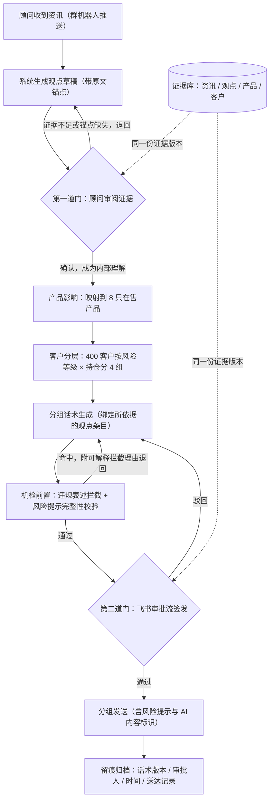
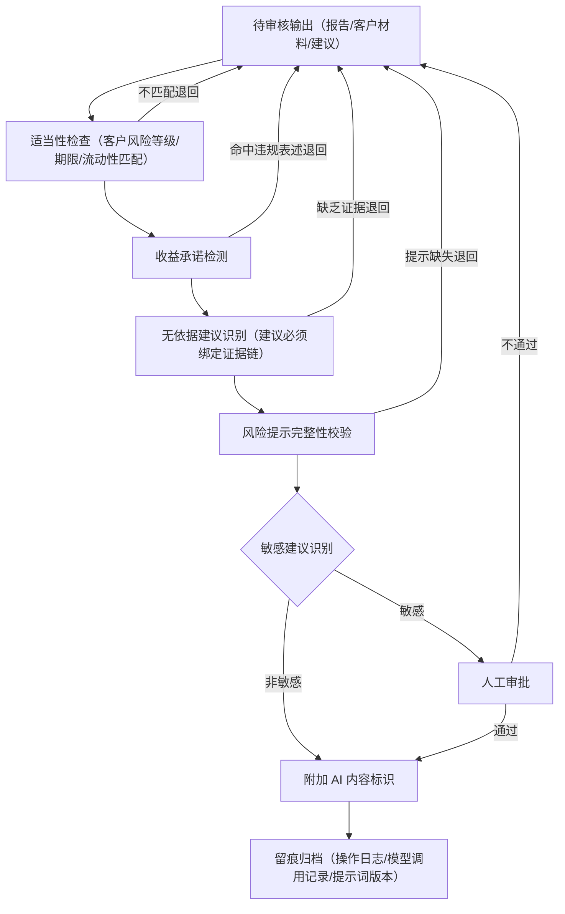
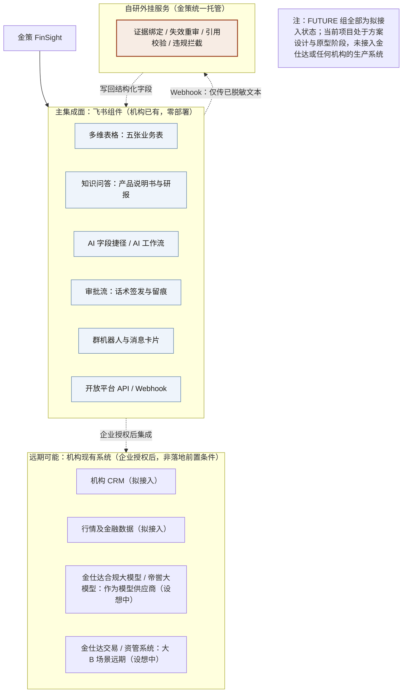

# 金策 FinSight 技术架构与业务流程图集

---

## 引言：如何阅读这套图

这套图集刻意把"技术分层"与"产品模块"两个维度分开表达。产品模块（七大模块）回答的是"用户在产品里完成什么工作"，技术分层（六层架构）回答的是"这些能力在系统里由谁承载、依赖什么"。两者不是一一对应，而是支撑关系。

阅读时请把握一条贯穿全部八张图的原则：**图中所有"通过""生成""完成"等状态，凡未特别说明，均指目标状态迁移，而非当前已实现的能力。** 每张图前的说明文字会逐一交代——哪些部分复用了先导工程、哪些属于 MVP 首版要做、哪些要等企业授权或数据条件明确后再做。

---

## 图 1 产品架构图（六层架构 + 用户层 + 输出层）

**核心判断**：证据链之所以被单独抽出、置于分析引擎之后，是因为原始检索片段不能直接充当结论依据；合规之所以画成横向贯穿层，是因为适当性、权限与审计无法只在最终文案上"补做"。这两处结构选择，正是金策与普通"数据→模型→报告"直线架构的根本区别。

技术分层与七大产品模块是两个不同维度的划分：七大模块描述用户在产品中完成的工作，六层架构描述这些能力在系统中的技术承载与依赖关系。**六层是职责划分，每层由具体的飞书组件承载**——各层的组件归属与需要自研外挂补齐的缺口，见 `docs/07_飞书实现方案.md` §2 与 §3。

这张图用于固定产品模块边界，而不是表示各层已经存在。证据链单独位于分析引擎之后，是因为原始检索片段不能直接当作结论依据；产品与客户匹配必须消费经过来源、时间和推断类型标记的中间结果。合规层画成横向约束，原因是适当性、权限和审计不能只在最终文案上补做。

用户层的四类角色与 `docs/01_开题方案.md` §五 一致，其中**客户（大 C）是只读接收方，不是系统操作者**——他看到的永远是经持牌顾问在飞书审批流中确认后的内容，这既是产品选择也是合规必需。

MVP 先收敛到公开资讯入库、观点生成、产品要素抽取、客户分层、话术草稿与人工确认。知识图谱、完整客户画像自动构建、面向真实客户的直接触达暂不实现；客户沟通材料仅保留演示模板。

需要说明：观点与情景分析层的工作发生在「观点整理」环节内部，不单独占用链路时间——传导路径与情景假设随观点一并生成、一并登记失效条件，链路中不存在一个独立的情景推演步骤。

---

## 图 2 技术架构图

**核心判断**：这张图只有一条线值得看——**飞书原生组件与自研外挂服务之间的那条边界线**。边界以内是机构已经拥有、零部署即可使用的能力；边界以外的四项外挂，才是金策真正要写的代码，也是这个项目全部技术含量之所在。把这条线画出来，比把架构画得漂亮重要得多。

图中蓝底方框为飞书原生组件，橙底方框为自研外挂服务。这样区分的原因是：飞书原生 AI 擅长无状态的文本变换（摘要、分类、抽取、改写），不擅长需要跨记录一致性、字段级锚点、时间维度重审与可解释拦截理由的任务；后四类恰好就是金策可信性要求的落点。判定标准与四项外挂的逐项论证见 `docs/07_飞书实现方案.md` §3.1 与 §3.2。

外挂服务的部署形态直接决定"数据不出机构飞书租户"这一承诺是否成立。MVP 默认采用 `docs/07` §3.3 的**形态三**：外挂由金策统一托管、只处理已脱敏数据——客户姓名、手机号、身份证号从未入表，持仓金额区间化、持仓明细类别化，话术正文以占位符存储客户称呼，因此经 Webhook 流出的文本不含个人信息。这一形态成立的**唯一前置条件**是脱敏规则被严格执行；一旦破例，形态三即退化为不可接受的第三方云形态。

模型由飞书侧提供、编排由 AI 工作流承担，因此不单独设置模型网关、API 网关与自建 Pipeline 编排层。Mindraft AI Gateway 的四阶段编排经验可作参考，但**代码不直接复用**。图中飞书侧各组件的具体能力与配额**待实测确认**，团队尚未在飞书中实际搭建任何环节。

---

## 图 3 数据流程图

**核心判断**：数据管线把"来源、发布时间、更新时间、原文位置"作为最优先保存的字段，因为这些字段一旦丢失，事后几乎无法从向量片段中可靠恢复。冲突检测则坚持"不自动选择正确版本"——静默覆盖会让报告丧失可解释性。

数据管线优先保存来源、发布时间、更新时间与原文位置，因为这些字段事后通常无法从向量片段中可靠恢复。冲突检测不自动选择"正确版本"，而是把口径、时间或来源的冲突交给上层标注与人工复核；否则清洗阶段的静默覆盖，会让最终报告无法被解释。

**"来源标记与原文定位"这一环必须由外挂承担**：飞书的 AI 字段捷径输出的是文本，不输出原文锚点（来源、段落位置、发布时间），锚点一旦在入库阶段丢失，后续任何环节都无法可靠恢复。这正是 `docs/07_飞书实现方案.md` §3.2 外挂一存在的理由，图中该节点标为橙色以示区分。

**脱敏发生在入表之前，不是之后**。客户档案进入客户库前即按 `docs/07` §4.1 处理：姓名、手机号、身份证号不设字段，持仓金额区间化，持仓明细类别化。这一顺序不可颠倒——先入表再脱敏等于已经泄露。

存储分两类：多维表格承担结构化数据，知识问答承担长文档语义检索，**不使用图谱库**。理由是两人团队同时维护三套索引不现实，而中小 B 场景下语义检索加结构化字段已能覆盖绝大多数需求（与 `docs/01_开题方案.md` §十二 口径一致）。

MVP 计划先接入公开资讯、政策材料、少量产品说明书与模拟客户档案，建立一份可复现的语料快照。授权研报、机构内部材料仅在授权与权限模型确定后接入；全量实体消歧与自动失效传播暂缓。飞书侧各组件的写入能力与配额**待实测确认**。

---

## 图 4 多智能体协作图

**核心判断**：6 类职责是"责任划分"，不是"6 个必须同时启动的模型实例"。让"生成"与"复核"由不同执行体完成，目的是形成交叉检验、让错误更早暴露；两道人工门槛分别卡在"观点成为内部理解"与"话术允许对外"两处，是为了阻止未经确认的推断一路滑到客户手里。

智能体职责划分为 6 类：资讯解读、观点整理、产品理解、客户匹配、话术生成、合规复核（与 `docs/01_开题方案.md` §十一 一致）。划分理由：因果、情景、组合三类分析在中小 B 场景下不各自独立成岗——顾问要的是"这条消息对我这 8 只产品意味着什么"，而不是一份跨资产传导报告。首版可由同一基础模型按角色提示词串行执行，各角色输出使用不同 schema，以便定位是资讯理解、观点生成、产品匹配还是合规环节出的错。

编排由飞书 AI 工作流承担，证据绑定、引用校验与违规拦截由外挂节点完成：图中橙色节点由自研外挂承担，其余由飞书原生能力承担。Mindraft AI Gateway 的四阶段编排经验可作参考，但**代码不直接复用**，飞书路线下的编排能力**待实测确认**。

图中的三条回退线对应 `docs/01` §十一 的三条异常处理规则：找不到材料标"缺失"而非生成填补、结论冲突时并列展示而非取平均、模型失败可切换但必须记录。

---

## 图 5 证据链生成流程图

**核心判断**：证据链坚持"先定位原文，再允许生成结论"的顺序。这一顺序的直接好处，是让"引用覆盖率"与"引用支持率"可以被分别计分、分别检验——推断字段绝不能伪装成来源原话。

证据链采用"先定位原文，再允许生成结论"的顺序，目的是让引用覆盖与引用支持可以分别计分。推断字段不能伪装成来源原话；假设、反例与失效条件与结论一并保存，便于数据更新后判断哪些段落需要重审。

MVP 不尝试自动证明因果，也不把模型输出的置信度当作统计概率。首版先实现证据编号、时间、原文锚点、陈述类型与人工确认状态；自动反例检索、置信度校准、失效条件触发与跨报告依赖更新，待评测数据积累后再实现。

---

## 图 6 用户业务流程图

**核心判断**：内部理解与对外话术建立在**同一份证据版本**之上，但两道门槛的审核标准截然不同——这一设计在中小 B 场景下尤为关键：写内部理解的人和发客户话术的人是同一位顾问，一个人走完全程，把内部推断直接搬给客户的风险更高。**流程必须替代掉那个不存在的第二个人。**

中小 B 没有投研团队，也没有专职合规，`docs/01_开题方案.md` §五 的角色设定为顾问、机构负责人、合规兼岗与只读接收的客户。因此业务流设计为**顾问单人主线 + 两道机器门槛**：第一道门卡在观点成为内部理解之前，第二道门卡在话术允许对外之前，两道门之间共享同一份证据库。

第二道门为什么必须是飞书审批流而不是一个自建确认按钮：审批流天然带责任人、时间戳与不可抵赖记录，签发动作本身即构成留痕（论证见 `docs/07_飞书实现方案.md` §2.6）。合规兼岗人员精力有限，所以机检必须前置——能在机器层拦下的（收益承诺、保本稳赚、风险提示缺失）绝不留到人工环节。

MVP 演示到"观点草稿 + 4 组模拟话术 + 审批占位状态"为止，**不连接真实客户、不执行真实发送**。电子签批、机构档案系统与不可篡改归档需结合实际部署环境实现，暂不在原型中承诺；飞书审批的具体能力**待实测确认**。

---

## 图 7 合规审核流程图

**核心判断**：审核顺序刻意"先硬后软"——先处理可确定的硬规则（收益承诺、风险提示字段），再处理需要语义判断的敏感建议，从而使每一次阻断都能给出可解释的理由。适当性检查一旦字段缺失，应返回"无法判断"，绝不默认通过。

审核顺序先处理可确定的硬规则，再处理需要语义判断的敏感建议，便于解释每次阻断的原因。适当性检查依赖客户风险等级、期限与流动性等结构化字段；字段缺失时应返回"无法判断"，不能默认通过。规则命中与模型判断都只形成预审结果，最终签发仍由具备权限的人员完成。

MVP 先做收益承诺词、风险提示字段、证据绑定与 AI 标识检查，并记录规则版本。真实适当性引擎、机构规则库、审批权限、电子签名与归档策略尚未实现；图中的"通过"表示目标状态迁移，不表示当前样稿已经获得合规批准。

---

## 图 8 飞书组件集成与远期系统对接示意图

**核心判断**：金策的主集成面是飞书组件——机构已有、零部署；图中唯一的外延是自研外挂服务，且经 Webhook 只传已脱敏文本。机构现有系统与金仕达能力属企业授权后的远期设想，**不是落地的前置条件**。

主集成面全部是飞书原生组件：多维表格、知识问答、AI 字段捷径与工作流、审批流、群机器人与开放平台 API。自研外挂服务经 Webhook 与多维表格交互，仅传输已脱敏文本（口径与部署形态见 `docs/07_飞书实现方案.md` §3.3）。机构 CRM、行情数据、金仕达模型能力与交易/资管系统全部归入远期组，只有在企业授权、接口确认与安全评审之后才能进入开发。

必须声明：当前未接入金仕达或任何机构的生产系统；MVP 不实现任何真实系统对接，远期组仅用于说明边界。

---

## 附：图清单与实施边界

下表把八张图各自的"MVP 首版要做什么"与"暂不实现/后续条件"并列，作为对全文状态边界的一次收束——它同时也是一份提醒：图纸的完整，并不等于系统的完成。

| 序号 | 图名 | MVP 处理 | 暂不实现/后续条件 |
|---|---|---|---|
| 1 | 产品架构图 | 公开资讯入库、观点生成、产品要素抽取、客户分层、话术草稿、人工确认 | 知识图谱、客户画像自动构建、真实客户直接触达 |
| 2 | 技术架构图 | 飞书原生组件承载五层职责，外挂四项经 Webhook 接入；编排经验参考先导项目 | 外挂四项均未实现；飞书侧能力待实测确认 |
| 3 | 数据流程图 | 公开资讯与模拟档案快照、来源与时间字段、入表前脱敏、语义加结构化检索 | 授权研报、内部材料、全量实体消歧、自动失效传播 |
| 4 | 多智能体协作图 | 6 类职责串行流程、两道人工门槛、外挂节点 | 多实例并行、复杂冲突仲裁 |
| 5 | 证据链生成流程图 | 编号、时间、原文锚点、陈述类型、确认状态 | 自动因果证明、置信度校准、失效自动传播 |
| 6 | 用户业务流程图 | 观点草稿 + 4 组模拟话术 + 审批占位状态 | 真实客户连接、真实发送、电子签批 |
| 7 | 合规审核流程图 | 基础规则、证据绑定、风险提示与 AI 标识检查 | 真实适当性引擎、机构规则库与签发权限 |
| 8 | 飞书组件集成与远期系统对接示意图 | 仅定义集成面与边界 | 远期组全部须企业授权后集成 |
