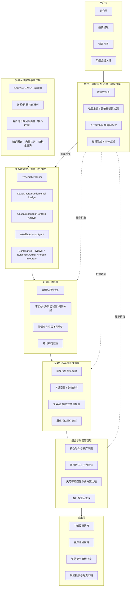
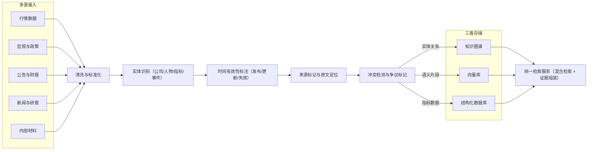
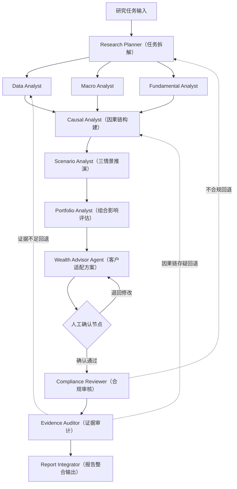
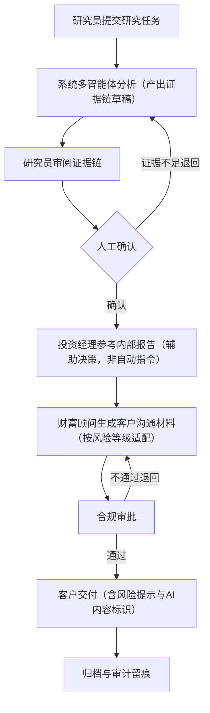
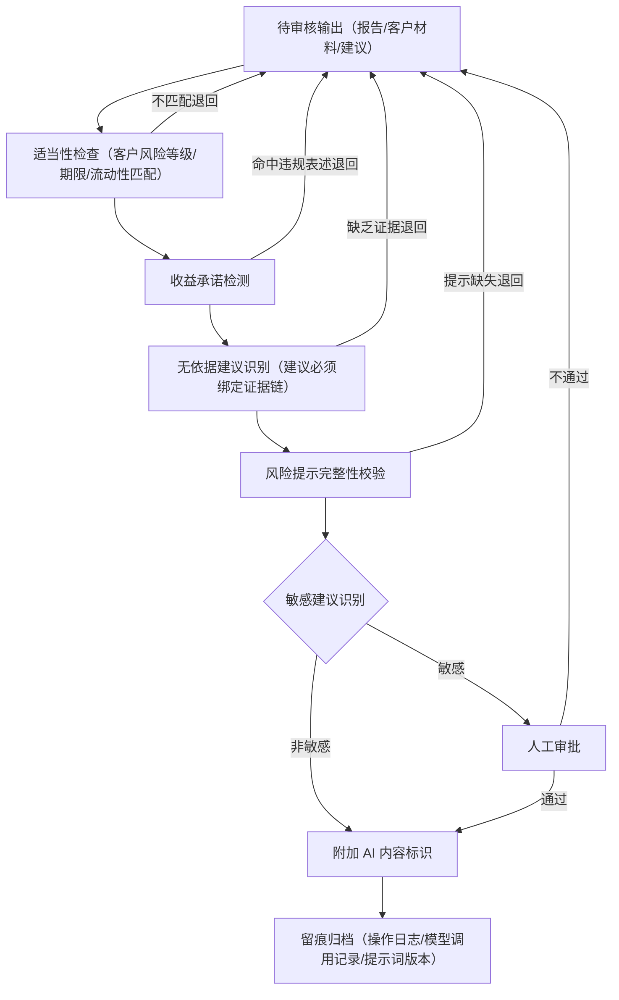
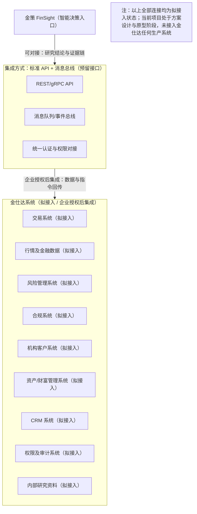

# 金策 FinSight 技术架构与业务流程图集

---

## 引言：如何阅读这套图

这套图集刻意把"技术分层"与"产品模块"两个维度分开表达。产品模块（七大模块）回答的是"用户在产品里完成什么工作"，技术分层（六层架构）回答的是"这些能力在系统里由谁承载、依赖什么"。两者不是一一对应，而是支撑关系。

阅读时请把握一条贯穿全部八张图的原则：**图中所有"通过""生成""完成"等状态，凡未特别说明，均指目标状态迁移，而非当前已实现的能力。** 每张图前的说明文字会逐一交代——哪些部分复用了先导工程、哪些属于 MVP 首版要做、哪些要等企业授权或数据条件明确后再做。

---

## 图 1 产品架构图（六层架构 + 用户层 + 输出层）

**核心判断**：证据链之所以被单独抽出、置于分析引擎之后，是因为原始检索片段不能直接充当结论依据；合规之所以画成横向贯穿层，是因为适当性、权限与审计无法只在最终文案上"补做"。这两处结构选择，正是金策与普通"数据→模型→报告"直线架构的根本区别。

技术分层与七大产品模块是两个不同维度的划分：七大模块描述用户在产品中完成的工作，六层架构描述这些能力在系统中的技术承载与依赖关系。

这张图用于固定产品模块边界，而不是表示各层已经存在。证据链单独位于分析引擎之后，是因为原始检索片段不能直接当作结论依据；组合与客户材料必须消费经过来源、时间和推断类型标记的中间结果。合规层画成横向约束，原因是适当性、权限和审计不能只在最终文案上补做。

MVP 先收敛到公开信息检索、研究草稿、证据字段、模拟组合计算和人工确认。知识图谱、完整客户画像接入、自动多方案比较及面向真实客户的输出暂不实现；客户沟通材料仅保留演示模板。

---

## 图 2 技术架构图

**核心判断**：把编排层与模型网关拆开，是一次刻意的工程取舍——它让"业务如何流转"与"用哪个模型"彼此解耦，从而在更换模型时不必改动业务状态机，也能独立核算每个阶段的成本。

工程上把编排层与模型网关拆开：前者负责任务状态、回退与人工节点，后者只处理模型供应商、角色路由与调用记录。这样更换模型时不改业务状态机，也能独立核算每个阶段的成本。Mindraft AI Gateway 已有四阶段 Pipeline、SSE trace、runs/run_steps 落库与统一模型接入，可复用其工程模式；但需强调，这些代码尚不等同于图中的金策服务。

私有化边界是目标部署约束，不代表当前已有机构内网环境。MVP 可先采用向量检索加结构化查询；知识图谱检索、完整 RBAC、机构级数据分级与自动降级策略，待接口与数据条件明确后再做——同时维护三套尚不成熟的索引，只会分散有限的开发精力。

```mermaid
flowchart TB
    subgraph EDGE["私有化部署边界（金融机构内网）"]
        subgraph FE["前端工作台"]
            FE1["研究员/投资经理工作台"]
            FE2["财富顾问工作台"]
            FE3["证据链审阅界面"]
        end

        subgraph GW["API 网关"]
            GW1["统一鉴权与限流"]
            GW2["请求路由与审计埋点"]
        end

        subgraph ORCH["多智能体编排层"]
            OC1["任务规划与拆解"]
            OC2["Pipeline 编排（Plan-Worker-Review-Integrate）"]
            OC3["执行追踪与状态落库"]
            OC4["冲突回退与人工确认节点"]
        end

        subgraph MG["模型网关"]
            MG1["多模型统一接入"]
            MG2["按角色路由（规划/分析/审核）"]
            MG3["失败回退与降级模型"]
            MG4["调用记录与提示词版本管理"]
        end

        subgraph RET["检索层"]
            R1["向量检索（语义）"]
            R2["知识图谱检索（实体关系）"]
            R3["结构化查询（行情/财务）"]
            R4["混合检索与证据组装"]
        end

        subgraph DATA["数据层"]
            DA1["多源原始库"]
            DA2["清洗后知识库"]
            DA3["图谱库/向量库/结构化库"]
            DA4["脱敏与权限分级"]
        end

        subgraph AUD["审计与权限（横切）"]
            AU1["操作日志"]
            AU2["模型调用留痕"]
            AU3["角色权限与数据分级"]
        end

        FE --> GW --> ORCH
        ORCH --> MG
        ORCH --> RET
        MG --> RET
        RET --> DATA
        AUD -.横切留痕.-> GW
        AUD -.横切留痕.-> ORCH
        AUD -.横切留痕.-> MG
    end
```

---

## 图 3 数据流程图

**核心判断**：数据管线把"来源、发布时间、更新时间、原文位置"作为最优先保存的字段，因为这些字段一旦丢失，事后几乎无法从向量片段中可靠恢复。冲突检测则坚持"不自动选择正确版本"——静默覆盖会让报告丧失可解释性。

数据管线优先保存来源、发布时间、更新时间与原文位置，因为这些字段事后通常无法从向量片段中可靠恢复。冲突检测不自动选择"正确版本"，而是把口径、时间或来源的冲突交给上层标注与人工复核；否则清洗阶段的静默覆盖，会让最终报告无法被解释。

MVP 计划先接入公开公告、政策材料与少量结构化示例数据，建立一份可复现的语料快照。新闻、研报、内部材料仅在授权与权限模型确定后接入；知识图谱、全量实体消歧与自动失效传播暂缓。向量库与结构化库先满足检索与重算的需要，图谱库保留接口但不作为首版依赖。

---

## 图 4 多智能体协作图

**核心判断**：11 个角色是"责任划分"，不是"11 个必须同时启动的模型实例"。让"分析"与"复核"由不同执行体完成，目的是形成交叉检验、让错误更早暴露；人工确认被刻意放在客户适配之后，则是为了拦住"未经确认的具体处置表述"继续流入合规与整合阶段。

11 个角色是责任划分，不要求 MVP 启动 11 个独立模型实例。首版可由同一基础模型按角色提示词串行执行，各角色输出使用不同 schema，以便定位事实、因果、组合或合规环节的错误。人工确认放在客户适配之后，是为了阻止未经确认的具体处置表述继续进入合规与整合阶段。

Mindraft AI Gateway 已有 Planner → Worker → Reviewer → Integrator 与单轮 repair，可作为编排起点。但并行 Worker、角色/模型编辑器与复杂冲突仲裁，在该先导项目中仍属规划中；因此金策 MVP 不假定并行吞吐已经实现，而是先验证串行流程、回退上限与日志的可追溯性。

---

## 图 5 证据链生成流程图

**核心判断**：证据链坚持"先定位原文，再允许生成结论"的顺序。这一顺序的直接好处，是让"引用覆盖率"与"引用支持率"可以被分别计分、分别检验——推断字段绝不能伪装成来源原话。

证据链采用"先定位原文，再允许生成结论"的顺序，目的是让引用覆盖与引用支持可以分别计分。推断字段不能伪装成来源原话；假设、反例与失效条件与结论一并保存，便于数据更新后判断哪些段落需要重审。

MVP 不尝试自动证明因果，也不把模型输出的置信度当作统计概率。首版先实现证据编号、时间、原文锚点、陈述类型与人工确认状态；自动反例检索、置信度校准、失效条件触发与跨报告依赖更新，待评测数据积累后再实现。

---

## 图 6 用户业务流程图

**核心判断**：内部研究报告与客户材料建立在**同一份证据版本**之上，但两者的权限与措辞规则截然不同——这保证了同一条证据"经过谁确认、进入了哪份材料"始终可以在同一个 run 中被追溯。

业务流把内部研究报告与客户材料放在同一证据版本上，但两者的权限与措辞规则不同。投资经理节点只接收研究参考，不接收自动交易指令；客户交付必须晚于研究员确认与合规审批。如此，便可在同一 run 中追踪"哪条证据经过谁确认后进入了哪份材料"。

MVP 演示到"内部草稿 + 模拟客户材料 + 审批占位状态"为止，不连接真实客户、不执行发送，也不产生交易指令。跨角色账号、电子签批、机构档案系统与不可篡改归档，需结合实际部署环境实现，暂不在原型中承诺。

---

## 图 7 合规审核流程图

**核心判断**：审核顺序刻意"先硬后软"——先处理可确定的硬规则（收益承诺、风险提示字段），再处理需要语义判断的敏感建议，从而使每一次阻断都能给出可解释的理由。适当性检查一旦字段缺失，应返回"无法判断"，绝不默认通过。

审核顺序先处理可确定的硬规则，再处理需要语义判断的敏感建议，便于解释每次阻断的原因。适当性检查依赖客户风险等级、期限与流动性等结构化字段；字段缺失时应返回"无法判断"，不能默认通过。规则命中与模型判断都只形成预审结果，最终签发仍由具备权限的人员完成。

MVP 先做收益承诺词、风险提示字段、证据绑定与 AI 标识检查，并记录规则版本。真实适当性引擎、机构规则库、审批权限、电子签名与归档策略尚未实现；图中的"通过"表示目标状态迁移，不表示当前样稿已经获得合规批准。

---

## 图 8 金仕达系统集成示意图

**核心判断**：这张图只定义"潜在的集成面"，不假定金仕达任何具体系统的接口、数据模型或部署方式。优先采用 API 与事件消息，是为了把研究任务、证据版本与审批状态同交易核心解耦；金策不会自行扩大数据权限。

该图只定义潜在集成面，不假定金仕达具体系统的接口、数据模型或部署方式。优先采用 API 与事件消息，是为了把研究任务、证据版本与审批状态与交易核心解耦；统一认证与审计应由企业侧策略约束，金策不自行扩大数据权限。

必须再次声明：当前没有接入金仕达任何生产系统。MVP 不实现交易指令回传，最多以 mock 接口演示任务输入与研究结果输出。行情、风控、合规、客户、财富管理、CRM、权限审计及内部研究资料，均为后续拟接入项，只有在企业授权、接口确认与安全评审之后才能进入开发。

---

## 附：图清单与实施边界

下表把八张图各自的"MVP 首版要做什么"与"暂不实现/后续条件"并列，作为对全文状态边界的一次收束——它同时也是一份提醒：图纸的完整，并不等于系统的完成。

| 序号 | 图名 | MVP 处理 | 暂不实现/后续条件 |
|---|---|---|---|
| 1 | 产品架构图 | 公开信息、研究草稿、证据字段、模拟组合、人工确认 | 真实客户服务与自动方案执行 |
| 2 | 技术架构图 | 复用先导项目的编排、trace 与模型接入经验 | 完整私有化环境、知识图谱、机构级 RBAC |
| 3 | 数据流程图 | 少量公开语料快照、来源与时间字段、向量/结构化检索 | 授权研报、内部材料、全量实体消歧 |
| 4 | 多智能体协作图 | 角色化串行流程、有限 repair、日志留痕 | 11 实例并行、复杂冲突仲裁 |
| 5 | 证据链生成流程图 | 编号、时间、原文锚点、陈述类型、确认状态 | 自动因果证明、置信度校准、失效自动传播 |
| 6 | 用户业务流程图 | 内部草稿与模拟客户材料，审批状态占位 | 真实发送、交易指令、机构电子签批 |
| 7 | 合规审核流程图 | 基础规则、证据绑定、风险提示与 AI 标识检查 | 真实适当性引擎、机构规则库与签发权限 |
| 8 | 金仕达系统集成示意图 | mock 接口可用于演示边界 | 全部生产连接均须企业授权后集成 |
