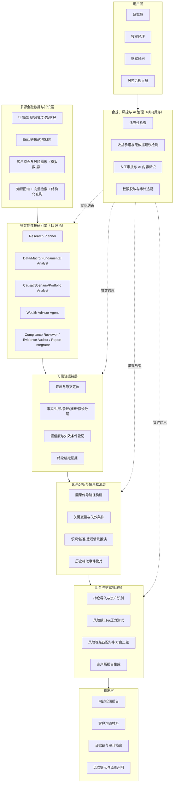
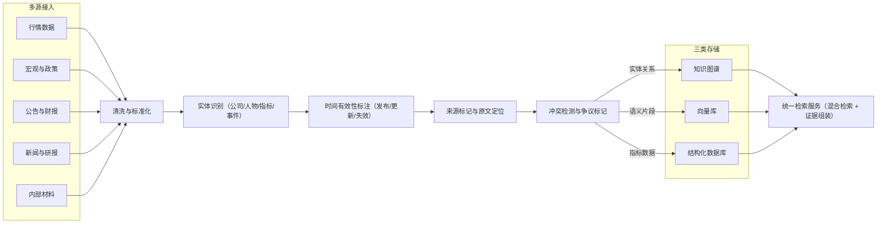
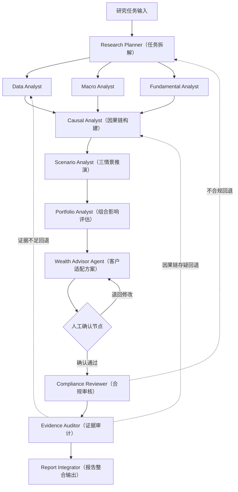
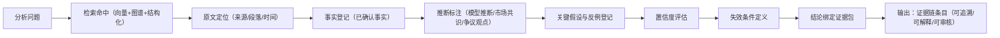
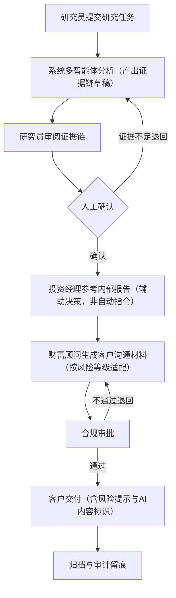
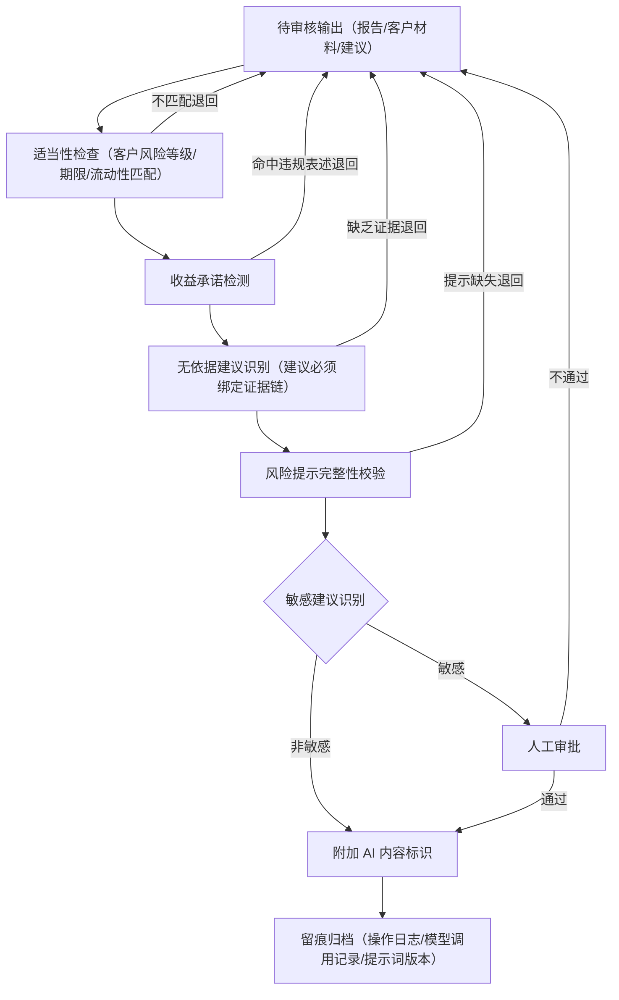
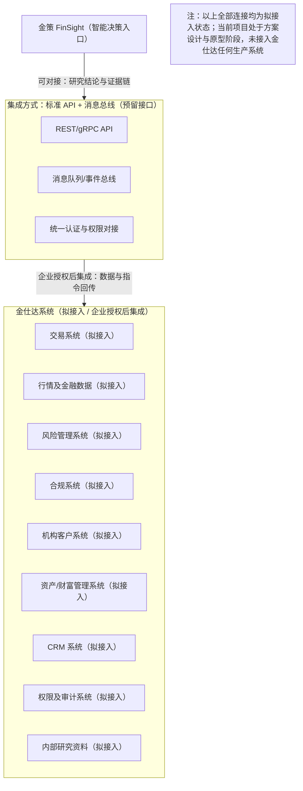

# 金策 FinSight 技术架构与业务流程图集

> 版本：v1.0 ｜ 依据：00_金策_FinSight_项目事实库.md
> 说明：本文件所有图示均为**架构设计图·规划中**，对应系统当前处于方案设计与产品原型阶段，不代表已开发完成或已上线。
> 图示风格说明：全部 Mermaid 图采用默认浅色系主题，无深底色块、无高饱和配色，黑白打印与深色阅读环境下均可清晰辨认，属深色打印友好设计。

---

## 图 1 产品架构图（六层架构 + 用户层 + 输出层）

> 架构设计图·规划中

**图说明**：本图呈现金策 FinSight 的产品分层结构。自下而上依次为数据知识层、多智能体投研引擎、可信证据链、因果推演、组合与财富管理、合规与 AI 治理六大子系统；顶部为用户层与输出层。设计意图是强调"合规即流程"——合规治理不是外围模块，而是贯穿所有层级的横向约束；证据链与因果推演位于引擎与决策之间，确保任何结论在被采纳前都经过事实分层与推演校验，体现"证据原生"的核心创新。

---

## 图 2 技术架构图

> 架构设计图·规划中

**图说明**：本图描述系统工程技术栈的纵向切分，从研究员工作台前端，经 API 网关、多智能体编排层、模型网关（多模型路由与回退），到检索层（向量 + 图谱 + 结构化三类索引）与数据层。审计与权限作为横切关注点独立成块；整图置于私有化部署边界之内，明确金融机构数据不出域的部署要求。设计意图是说明多模型路由与单点故障回退、执行追踪落库等技术基础，均来自先导项目 Mindraft AI Gateway 已验证的能力迁移。

```mermaid
flowchart TB
    subgraph EDGE["私有化部署边界（金融机构内网）"]
        subgraph FE["前端工作台"]
            FE1["研究员/投资经理工作台"]
            FE2["财富顾问工作台"]
            FE3["证据链审阅界面"]
        end

        subgraph GW["API 网关"]
            GW1["统一鉴权与限流"]
            GW2["请求路由与审计埋点"]
        end

        subgraph ORCH["多智能体编排层"]
            OC1["任务规划与拆解"]
            OC2["Pipeline 编排（Plan-Worker-Review-Integrate）"]
            OC3["执行追踪与状态落库"]
            OC4["冲突回退与人工确认节点"]
        end

        subgraph MG["模型网关"]
            MG1["多模型统一接入"]
            MG2["按角色路由（规划/分析/审核）"]
            MG3["失败回退与降级模型"]
            MG4["调用记录与提示词版本管理"]
        end

        subgraph RET["检索层"]
            R1["向量检索（语义）"]
            R2["知识图谱检索（实体关系）"]
            R3["结构化查询（行情/财务）"]
            R4["混合检索与证据组装"]
        end

        subgraph DATA["数据层"]
            DA1["多源原始库"]
            DA2["清洗后知识库"]
            DA3["图谱库/向量库/结构化库"]
            DA4["脱敏与权限分级"]
        end

        subgraph AUD["审计与权限（横切）"]
            AU1["操作日志"]
            AU2["模型调用留痕"]
            AU3["角色权限与数据分级"]
        end

        FE --> GW --> ORCH
        ORCH --> MG
        ORCH --> RET
        MG --> RET
        RET --> DATA
        AUD -.横切留痕.-> GW
        AUD -.横切留痕.-> ORCH
        AUD -.横切留痕.-> MG
    end
```

---

## 图 3 数据流程图

> 架构设计图·规划中

**图说明**：本图刻画数据从多源接入到对外检索服务的完整加工管线。关键设计环节是"实体识别、时间有效性、来源标记、冲突检测"四道质量闸门——它们保证进入知识库的任何条目都自带来源与时间属性，冲突数据不被静默合并而是显式标记，为上层证据链的"事实/共识/争议"分层提供数据基础。设计意图是体现"证据原生"：可追溯性在数据入库阶段即被写入，而非生成结论后补引用。

---

## 图 4 多智能体协作图

> 架构设计图·规划中

**图说明**：本图展示 11 个智能体角色的协作拓扑与审核回路。Research Planner 将研究任务拆解为并行子任务，Data/Macro/Fundamental 三个 Analyst 并行产出初步分析，再经 Causal 与 Scenario Analyst 构建因果链与情景推演，Portfolio Analyst 与 Wealth Advisor Agent 完成组合影响与客户适配。Compliance Reviewer 与 Evidence Auditor 实施交叉审核：任一审核不通过即沿冲突回退路径返回对应环节重做；涉及客户建议的关键节点必须经人工确认方可进入 Report Integrator。设计意图是落实"多智能体交叉审核"与"人机协同"两大创新点，明确 AI 仅辅助决策、责任边界在人。

---

## 图 5 证据链生成流程图

> 架构设计图·规划中

**图说明**：本图细化可信证据链子系统的内部生成流程：检索命中后先做原文定位，再登记事实依据；对超出原文的内容显式标注为模型推断，并同步登记关键假设与反例；随后由系统给出置信度与失效条件，最终将结论与完整证据包绑定输出。设计意图是让每一条结论都携带"来源、时间、位置、分层属性、假设、反例、置信度、失效条件"八要素，使审阅者能区分已确认事实、市场共识、争议观点与模型推断，这是"证据原生"区别于事后补引用的核心机制。

---

## 图 6 用户业务流程图

> 架构设计图·规划中

**图说明**：本图描述机构内部跨角色的端到端业务流。研究员提交研究任务后，系统产出带证据链的草稿，研究员逐条审阅证据并在关键判断处人工确认；投资经理将报告作为决策参考（而非指令）；财富顾问基于确认后的结论生成客户沟通材料；材料经合规审批后方可交付客户，全程归档可审计。设计意图是体现"人机协同"与"投研到财富管理一体化"：同一份经证据校验的投研结论，衍生出内部版与客户版两种材料，减少投研与销售之间的信息衰减，同时每一步保留清晰的人工责任边界。

---

## 图 7 合规审核流程图

> 架构设计图·规划中

**图说明**：本图展开合规、风控与 AI 治理子系统的审核管线，对一切对外输出按序执行：适当性检查、收益承诺检测、无依据建议识别、风险提示完整性校验、敏感建议识别；命中敏感项一律转人工审批；通过后附加 AI 内容标识，最后留痕归档。设计意图是落实"合规即流程"——合规不是发布前的一次性盖章，而是嵌入生成管线的必经环节；任一环节不通过即阻断输出并退回，从机制上保证不承诺收益、不出具无依据建议、不替客户决策。

---

## 图 8 金仕达系统集成示意图

> 架构设计图·规划中

**图说明**：本图说明金策 FinSight 与命题企业金仕达生态的集成设想。金策定位为智能决策入口，通过标准化 API 与消息总线与金仕达已有或潜在能力连接。图中所有连接均为**拟接入 / 可在企业授权后集成 / 为后续私有化落地预留接口**，当前不存在任何已完成的系统对接。设计意图是以审慎口径展示落地路径：金策提供多智能体投研与证据链能力，金仕达各系统提供交易、数据、风控与客户基础，双方在企业授权与私有化部署前提下完成集成，数据流向与权限审计均由金仕达侧管控。

---

## 附：图清单与状态

| 序号 | 图名 | 状态 |
|---|---|---|
| 1 | 产品架构图（六层 + 用户层 + 输出层） | 架构设计图·规划中 |
| 2 | 技术架构图（含私有化部署边界） | 架构设计图·规划中 |
| 3 | 数据流程图（接入到检索服务） | 架构设计图·规划中 |
| 4 | 多智能体协作图（11 角色 + 回退路径） | 架构设计图·规划中 |
| 5 | 证据链生成流程图 | 架构设计图·规划中 |
| 6 | 用户业务流程图（跨角色端到端） | 架构设计图·规划中 |
| 7 | 合规审核流程图 | 架构设计图·规划中 |
| 8 | 金仕达系统集成示意图（全部拟接入） | 架构设计图·规划中 |
