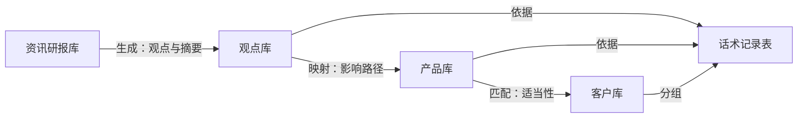

# 金策 FinSight 产品与客户数据模型

> 当前状态：方案设计 + 产品原型阶段，未开发完成、未上线。本文档中的五张表**均为纸面设计，尚未在飞书中创建**；字段类型与飞书多维表格实际支持的字段类型是否完全对应，待实测确认。全文涉及的客户、持仓、产品与话术数据均为**模拟数据**。
> 飞书环境已确认为**企业版**，记录级权限、字段级权限与管理后台数据隔离在能力范围内（具体套餐与可用性待实测确认）。

---

## 引言：这份文档要解决什么

**核心判断**：新链路里「产品理解」与「客户画像」两项能力此前没有对应的数据实体——`docs/01_开题方案.md` §九 给出了七个模块，`docs/07_飞书实现方案.md` §2.2 给出了四张表的设想，但字段级的设计一直缺位。这份文档把数据层落成五张表的字段清单，并用「由谁写入」一列把飞书原生能力与自研外挂的分工固定在字段粒度上。

设计依据：`docs/07` §2.2（四张多维表格）、§3.2（四项自研外挂）、§4.1（客户数据脱敏规则，硬约束）、§4.2（权限）；`docs/01` §七（降准贯穿场景）、§九（新七模块）、§十三（证据九字段）、§十五（研究如何落到产品与客户）。相较 `docs/07` §2.2 的四表设想，本文新增**话术记录表**——话术从生成、拦截、审批到发送的全流程需要独立留痕，并入观点库会混淆两类生命周期完全不同的记录。

---

## 一、五张表总览与关系

**核心判断**：五张表的关系就是 `docs/01` §六 新主线的数据化——资讯生成观点，观点映射产品，产品匹配客户，最终沉淀为可审批、可追溯的话术记录。

| 表 | 一句话职责 | 主要写入方 |
|---|---|---|
| 资讯研报库 | 登记原始材料及其来源、时间与摘要 | 人工 + AI 字段 |
| 观点库 | 登记带锚点的市场观点及其失效条件 | AI 字段 + 外挂 |
| 产品库 | 登记在售产品要素与适当性要求 | 人工 |
| 客户库 | 登记脱敏后的客户画像与分组 | 人工 |
| 话术记录表 | 登记话术从生成、拦截、审批到发送的全流程 | AI 字段 + 外挂 + 人工 |

---

## 二、资讯研报库

**核心判断**：这张表把"来源、发布时间、原文位置"作为最优先保存的字段——这些字段一旦丢失，事后几乎无法从摘要中恢复（口径与 `docs/05` 图 3 一致）。

| 字段名 | 类型 | 是否必填 | 说明 | 由谁写入 |
|---|---|---|---|---|
| 标题 | 单行文本 | 必填 | 材料标题 | 人工 |
| 类型 | 单选（资讯 / 研报） | 必填 | 两类材料的摘要模板不同 | 人工 |
| 来源机构 | 单行文本 | 必填 | 发布机构全称 | 人工 |
| 原文链接 | 超链接 | 必填 | 指向原始材料 | 人工 |
| 发布时间 | 日期时间 | 必填 | 材料自身的发布时间，非入库时间 | 人工 |
| 入库时间 | 日期时间 | 必填 | 录入本表的时间 | 人工 |
| AI 摘要 | 多行文本 | 必填 | 摘要仅为入口，不替代原文 | AI 字段 |
| 证据锚点 | 多行文本 | 必填 | 来源 + 段落位置 + 发布时间，供观点库引用 | 外挂（外挂一，`docs/07` §3.2） |
| 关联产品 | 关联（产品库） | 可选 | 该材料影响哪些在售产品 | 人工 |
| 关联观点 | 关联（观点库） | 可选 | 由该材料生成的观点条目 | 人工 |

---

## 三、观点库

**核心判断**：观点库是五张表中外挂依赖最重的一张——失效条件、失效状态、最后重审时间、引用支持判定四个字段全部来自自研外挂，飞书原生 AI 字段无法产出（判定方法见 `docs/07` §3.1）。

| 字段名 | 类型 | 是否必填 | 说明 | 由谁写入 |
|---|---|---|---|---|
| 结论 | 多行文本 | 必填 | 一条可独立核对的观点 | AI 字段 |
| 立场 | 单选（利多 / 利空 / 中性） | 必填 | 对相关资产的方向性判断 | AI 字段 |
| 适用情景 | 多行文本 | 必填 | 该观点成立的市场条件 | AI 字段 |
| 关键假设 | 多行文本 | 必填 | 对应 `docs/01` §十三 第 6 项 | AI 字段 |
| 失效条件 | 多行文本 | 必填 | 条件被触发时观点须重审，对应 §十三 第 9 项 | 外挂（外挂二） |
| 失效状态 | 单选（有效 / 待重审 / 已失效） | 必填 | 数据更新后由外挂巡检改写 | 外挂（外挂二） |
| 最后重审时间 | 日期时间 | 必填 | 最近一次重审发生的时间 | 外挂（外挂二） |
| 引用支持判定 | 单选（支持 / 部分支持 / 不支持） | 必填 | 检查引用是否真支持结论，判定细则同 `docs/06` §4.3 | 外挂（外挂三） |
| 证据锚点 | 多行文本 | 必填 | 指向资讯研报库的具体段落 | 外挂（外挂一） |
| 观点归属机构 | 单行文本 | 必填 | 区分本机构观点与外部观点，防止观点被写成事实 | 人工 |

---

## 四、产品库

**核心判断**：产品库回答的问题不是"这只产品好不好"，而是"这条资讯对这只产品意味着什么"——因此除产品要素外，必须保留"本次事件受影响维度"这一事件级字段。

| 字段名 | 类型 | 是否必填 | 说明 | 由谁写入 |
|---|---|---|---|---|
| 产品名 | 单行文本 | 必填 | 在售产品全称（模拟数据） | 人工 |
| 产品类型 | 单选 | 必填 | 如固收+、权益、混合、货币等 | 人工 |
| 风险等级 | 单选（R1–R5） | 必填 | 适当性匹配的输入 | 人工 |
| 费率 | 数字 | 必填 | 管理费等主要费率 | 人工 |
| 赎回规则 | 多行文本 | 必填 | 开放频率、持有期与赎回费 | 人工 |
| 底层资产 | 多行文本 | 必填 | 投向、久期、权益仓位等穿透要素，对应 `docs/01` §十五 第 1 步 | 人工 |
| 适当性要求 | 多行文本 | 必填 | 适配的投资者风险等级范围 | 人工 |
| 在售状态 | 单选（在售 / 暂停 / 下架） | 必填 | 不在售产品不进入话术生成 | 人工 |
| 说明书文档链接 | 超链接 | 必填 | 挂载到飞书知识问答的原文（待实测确认） | 人工 |
| 本次事件受影响维度 | 多行文本 | 事件期间必填 | 降准场景下该产品的受影响路径，事件结束后归档 | AI 字段 |

---

## 五、客户库

**核心判断**：客户库执行 `docs/07` §4.1 的脱敏规则，这不是可选的最佳实践，而是 `docs/07` §3.3 **形态三**（外挂服务由金策统一托管、只处理已脱敏数据）成立的前置条件——一旦有机构为追求匹配精度把真实姓名或精确金额写进表，整个数据流向的合规论证立即失效，形态三退化为不可接受的形态二。

因此：**客户姓名、手机号、身份证号一律不设字段**；持仓金额只存区间；持仓明细只存类别。真实身份与联系方式留在机构自有的客户台账中，不进入飞书。

| 字段名 | 类型 | 是否必填 | 说明 | 由谁写入 |
|---|---|---|---|---|
| 客户代号 | 单行文本 | 必填 | 如"客户 A"，与真实身份的映射留在机构自有台账 | 人工 |
| 风险等级 | 单选（R1–R5） | 必填 | 适当性匹配的输入 | 人工 |
| 投资期限 | 单选 | 必填 | 如 1 年内 / 1–3 年 / 3 年以上 | 人工 |
| 流动性约束 | 多行文本 | 必填 | 如"6 个月内可变现资产不低于 20%" | 人工 |
| 持仓金额区间 | 单选 | 必填 | 区间化，如"100–300 万"，不存精确金额 | 人工 |
| 持仓明细类别 | 单选 | 必填 | 类别化，如"权益类为主"，不存具体标的 | 人工 |
| 所属顾问 | 人员 | 必填 | 记录级权限的隔离依据（见 §七） | 人工 |
| 分组标签 | 单选 | 事件期间必填 | 按 §十五 分层规则（风险等级 × 是否持有固收+）自动归入 | 外挂 |

---

## 六、话术记录表

**核心判断**：话术是金策唯一会离开机构、到达大 C 的产物，因此它的每一条记录都必须能回答四个问题——依据哪条观点、涉及哪只产品、被机检拦过什么、由谁在何时放行。

一项必须固定在字段层的规则：话术正文以 `{{客户称呼}}`、`{{顾问称呼}}` 等占位符存储，个性化称呼在发送环节由顾问侧注入，不写入多维表格。理由有两重：其一，组话术天然是面向一组人的模板，一段发给 140 人的话术不可能以某一个人的称呼开头——这是逻辑必然；其二，占位符化保证外挂四经手的话术文本不含任何个人称谓，使 `docs/07_飞书实现方案.md` §3.3 形态三"外挂只处理已脱敏数据"的论证对这张表同样成立——这是合规必需。

| 字段名 | 类型 | 是否必填 | 说明 | 由谁写入 |
|---|---|---|---|---|
| 话术正文 | 多行文本 | 必填 | 顾问可直接发送的口吻，非研报体；正文以 `{{客户称呼}}` 等占位符存储，个性化称呼在发送环节由顾问侧注入，不写入多维表格 | AI 字段 |
| 目标客户组 | 关联（客户库分组） | 必填 | 话术与分组一一对应 | 人工 |
| 关联观点 | 关联（观点库） | 必填 | 话术依据的观点条目，缺失则不得送审 | 人工 |
| 关联产品 | 关联（产品库） | 必填 | 话术涉及的在售产品 | 人工 |
| 拦截结果 | 单选（通过 / 拦截） | 必填 | 送审前的机检结论 | 外挂（外挂四） |
| 拦截理由 | 多行文本 | 拦截时必填 | 命中规则编号 + 命中片段 + 为什么拦 + 处置建议 | 外挂（外挂四） |
| 审批状态 | 单选（待审批 / 已通过 / 已驳回） | 必填 | 对应飞书审批流（待实测确认） | 人工 |
| 审批人 | 人员 | 必填 | 持牌顾问或机构负责人 | 人工 |
| 审批时间 | 日期时间 | 必填 | 审批动作发生时间 | 人工 |
| 发送时间 | 日期时间 | 发送后必填 | 实际发出时间，用于留痕 | 人工 |

---

## 七、权限设计

**核心判断**：客户数据的隔离粒度必须到"顾问只能看到自己名下的客户"——中小 B 的 400 位客户分属 6 位顾问，全量可见在内部就是越权。

**主方案**（基于已确认的企业版环境）：客户库单表，按「所属顾问」字段做**记录级权限**隔离；产品库对顾问只读、对管理人员可写；话术记录表的审批字段仅审批人可写（字段级权限，待实测确认）。

| 表 | 财富顾问 | 合规兼岗人员 | 机构负责人 |
|---|---|---|---|
| 资讯研报库 | 可读可写 | 可读可写 | 可读可写 |
| 观点库 | 可读可写 | 可读可写，可标记失效 | 可读可写 |
| 产品库 | 只读 | 可读可写 | 可读可写 |
| 客户库 | 仅可见自己名下的记录，可写 | 全量可见，只读 | 全量可见，可读可写 |
| 话术记录表 | 可读可写（审批字段除外） | 全量可见，只读 | 全量可见，审批字段可写 |

**备用说明**：记录级权限通常需要企业版进阶版及以上套餐，当前套餐下的具体可用性**待实测确认**；若最终环境仅为标准版，则退回「一顾问一张表 + 汇总表只读」的形态。这一退路的代价必须如实写出：表数量随顾问数线性增长、跨顾问统计需额外汇总、字段口径的维护成本随之上升。

---

## 八、五张表与命题七项能力的对应

**核心判断**：七项能力各自有明确的主表，不存在"哪张表都沾一点"的模糊地带——数据模型的边界清晰，是后续评测能逐项归因的前提。

| 命题能力 | 主要依赖哪张表 | 对应 `docs/01` §九 模块 |
|---|---|---|
| 资讯解读 | 资讯研报库 | ① 资讯与研报接入 |
| 研报摘要 | 资讯研报库 | ① 资讯与研报接入 |
| 市场观点整理 | 观点库 | ② 观点整理与分歧看板 |
| 产品理解 | 产品库 | ③ 产品库与产品理解 |
| 客户画像 | 客户库 | ④ 客户库与画像 |
| 风险提示 | 话术记录表（拦截与审批字段） | ⑥ 风险提示与合规审核 |
| 服务话术生成 | 话术记录表 | ⑦ 话术生成与分层触达 |

⑤ 证据管理不对应单一主表，而是以外挂一、三落在观点库与话术记录表的锚点与支持判定字段上，支撑全部七项能力。

---

## 九、实施状态

**核心判断**：五张表目前全部是纸面设计——这是如实记录，不是疏漏。

| 事项 | 状态 |
|---|---|
| 五张表的字段设计 | 已完成（本文档） |
| 在飞书中实际创建五张表 | 未实现，待搭建 |
| 字段类型与多维表格实际支持的类型对应 | 待实测确认 |
| 记录级权限与字段级权限配置 | 待实测确认（依赖企业版套餐） |
| 外挂一至四的写入链路 | 未实现（方案见 `docs/07` §3.2、§3.3） |
| 模拟数据导入 | 未实现 |
